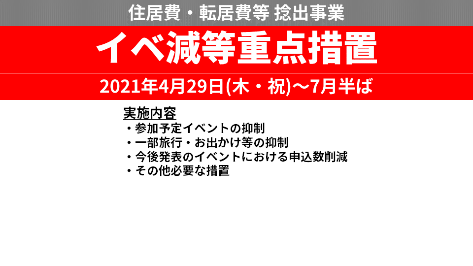
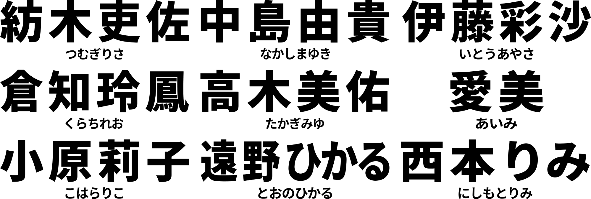
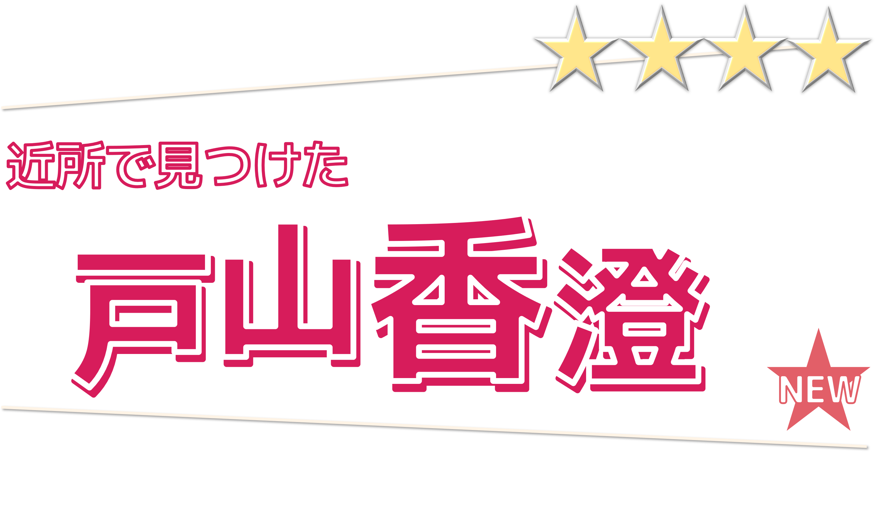
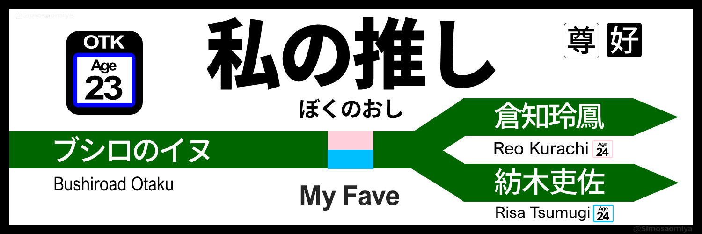

# SimosaOmiyaのプロフィールページ

- SimosaOmiyaのプロフィール掲載用Webページ(暫定)
- ちゃんとしたページが完成次第差し替え

## 基本情報
### 名前

**SimosaOmiya/しもおさ**

- 各種発信媒体では最近SimosaOmiya名義が大半
	- しもおさは旧称。
- どちらでお呼び頂いても結構です．

### 生年

<a href="https://twitter.com/Yuki_Nakashim" target="_blank">中島由貴さん</a>と数日違い

同じく推しの<a href="https://twitter.com/kurachireo" target="_blank">倉知玲鳳さん</a>も同い年

### 専門

都市計画・交通計画関係など

### すきなもの
- 声優・声優アーティスト・アニソン
- 交通関連（主に鉄道系）
- コーディング・プログラミング等(おべんきょ中)
	- めんどうなことを自動化するのが好きですw|
	
	
## 声優・声優アーティスト・アニソン

正直最近モチベはやや低め．

### 触れてる(た)もの

#### バンドリ（リアルバンド）
- RAISE A SUILEN
- Roselia
- Poppin'Party
- Morfonica

#### D4DJ
- Peaky P-key
- Photon Maiden
- Happy Around!
- Merm4id

#### バンドリ/D4DJ声優、響声優
- とのつむ（遠野ひかる，紡木吏佐）
- れおちゃん（倉知玲鳳）
- しまゆき（中島由貴）
- みゅー（高木美佑）
- チームY（あいみん，あやさ，みころん）
- その他ブシロードコンテンツに関わってる声優とか

#### その他
コロナ以前は割とDDしてた

- TrySail, スフィアとかメイン
- とはいえレーベル問わず、ある程度幅広く行きたいライブに行っていた
- アニソンフェスもある程度

### イベントとか

<a href="https://www.eventernote.com/users/verde_var2" target="_blank">イベント予定/実績（イベンターノート）</a>

- 過去の遺物．
- 最近は熱が冷め気味かつ金欠なので，たまに気が向いたら行く程度．

## 交通系
- 多分乗り鉄？
	- 特急・新幹線使った普通の鉄道旅行が好き（18耐久とかしないです）．
- Viewカード/モバイルSuica大好きマン
	- 生活費の大半はどちらかから支払われる模様 
	- 無駄にエクスプレス会員(View特約)
- 磁気券収集癖も一応ある
- 知識は基本東京圏JR
	- 基本的な駅・車両・乗換・メロディくらい
	- （友人と出かけたときに）歩く乗換案内として使えなくもないくらい
- 地域交通・交通システムを考えるのも好き
	- 大学でMaaSを研究してたかもしれない
	- 今のお仕事とも関わってなくもないかもしれない

## web関連
- **趣味程度**にデザイン・プログラミングとかお勉強してます
- 現状まだまだ勉強中で，**実務レベルには程遠い**です
- 全然わからんことだらけ

### 作ってるもの
[**声優三姉妹【チームY】非公式Webサイト** https://team-y.herokuapp.com/](https://team-y.herokuapp.com/)

- 全くもって完成形ではないです
	- ここ数ヶ月最近バグ放置
	
#### 使用技術
- Nuxt(SSR)
- MicroCMS(APIベースでコンテンツ提供)
- Heroku(PaaS)

#### 補足
- 動画情報部分は，①Youtube Data API叩いて，②整形して，③MicroCMSにPOST
	- Google Cloud Functions上にPythonベースで書いて構築
	- Cloud Schedularで自動実行
	- 概ね投稿から30分程度(スケジュール設定上)で動画情報自体も反映される．
		- 表示部分に混入したバグのフィックスをサボってるので、今は表示されずデータだけ蓄積されている 
- 実は色々初めて使ってるので，ちゃんとわかってない

### 使ってる / お勉強中 の技術
#### HTML/CSS
- 奥が深くて逆に分からない．
- Bootstrap使いがち
	- 如何にBootstrapを使って楽しつつ，それっぽく見えないデザインを作るかに命懸けてます（懸けてない）

#### JavaScript
- JQuery, Vue, Nuxtらへん
- 最近基礎から学び直し．
	- Vue, Nuxtはまさに勉強しながら使ってる． 
- JQueryは一時期結構使ってたけど，最近使ってなさすぎて忘れた

#### Python 
- Python自体は研究で使ってたので，まだ書ける方と自覚
- 中規模処理とかAPI叩くときも専ら利用
- request, pandas, matplotlib, (openpyxl)あたりもよく使う 
- Djangoをお勉強中だったけど最近放置してる．
- Anaconda/Jupitar Notebookで環境構築・コード実行とかしてる

#### Git/Github
- 一応軽く使ってるけど，そんなに使いこなせてはない

#### その他
- Github Pages: 一時期ここでwebページ運用してた．個人ページは今後GP使って立てたい．
- MicroCMS：最近のサイト構築はNuxt+MicroCMSを選びがち
- エディタ・IDEはVSCode派（Python関連利用時除く）

## その他
### ①たまによくわからん画像を生成

なんとなくそれっぽいフォントで

#### 作例1：イベ減等重点措置のお知らせ

JR東の工事のお知らせのデザインで、住居費等を捻出するためにイベ減をすることを告知した誰得画像

#### 作例2：万事に対するやる気が出ないマン

そのまま。たまに使う素材。

#### 作例3：声優の名前のフォルムを比較する画像

個人的には小原莉子さんと紡木吏佐さんのフォルムが好きです。

### ②フォント再現（？）など

アニメとか駅とかでどんなフォント使ってるのかたまに気になっちゃう系オタク（<a href="https://note.com/simosaomiya/n/n243946da3290" target="_blank">noteでも書きました</a>）

#### 作例4：ガルパガチャの名前部分再現

フォントだけ...

#### 作例5：JR東日本の駅名標デザインで推しの紹介をする画像

推しって中々絞れないよな。

## 自分の発信媒体
世の中の しもおさ / SimosaOmiya 名義のアカウントは全て自分だと思います（自分で確認した限り）．

- <a href="https://twitter.com/simosaomiya" target="_blank">Twitter(@simosaomiya)</a>
	- DMは開放されてますので，コンタクトはそちらにどうぞ．
- <a href="https://note.com/simosaomiya" target="_blank">note(SimosaOmiya/しもおさ)</a>
	- HiBiKi StYleのロケハン記事書いてます．
	- オタク雑記も混ざってます．
	- 交通系も書いたりします．
- <a href="https://www.youtube.com/channel/UCSSqnPW818ZzHP5xZ5PbDrA" target="_blank">Youtube(simousatrain)</a>
	- 基本的には昔の名残．
	- たまーに(数年に一度)ジャンル問わず動画あげます．
